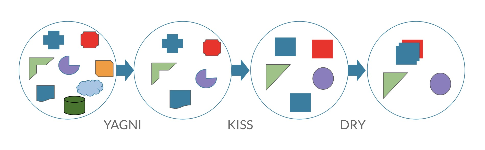

You Aren’t Gonna Need It / Вам это не понадобится

``1. Реализуйте только то, что нужно здесь и сейчас, а не в теории, что оно пригодится в будущем.``

``2. Подчищайте ненужный код (найдите через Git историю при надобности).``

``3. Программист не должен добавлять новый функционал, о котором его не просят (благими намерениями без должной проверки вы только добавите багов).``

