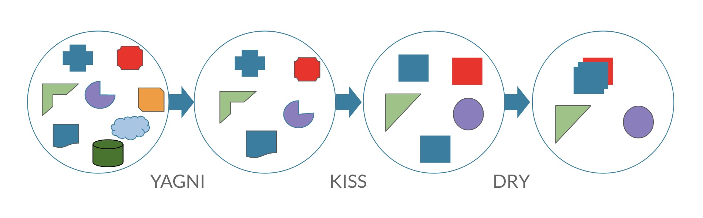

Keep it stupid simple («Пусть всё будет простым до безобразия»),

``1. Ваши методы должны быть небольшими (40-50 строк).``

``2. Каждый метод решает одну проблему.``

``3. При модификации кода в будущем не должно возникнуть трудностей.``

``4. Система работает лучше всего, если она не усложняется без надобности.``

``5. Не устанавливайте целую библиотеку ради одной функции из неё.``

``6. Не делай того, что не просят.``

