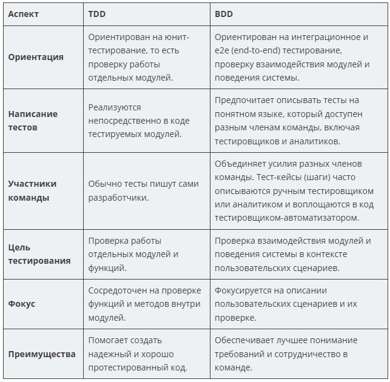

#### BDD (Behavior-Driven Development)
Основная идея заключается в описании поведения программы с использованием понятного языка, который понятен всем участникам проекта. Он ставит в центр внимания требования бизнеса и способствует лучшему пониманию требований.

