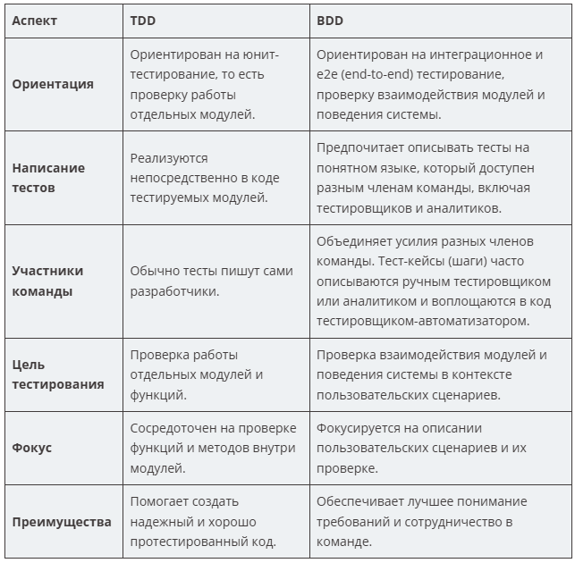

#### TDD (Test-Driven Development)
Основная идея заключается в том, чтобы сначала определить ожидаемое поведение программы через тесты, а затем писать код, чтобы тесты проходили успешно. Это позволяет создавать надежный и хорошо протестированный код.

``1) Прежде чем писать код реализации некоей возможности, пишут тест, который позволяет проверить, работает ли этот будущий код реализации, или нет. Прежде чем переходить к следующему шагу, тест запускают и убеждаются в том, что он выдаёт ошибку. Благодаря этому можно быть уверенным в том, что тест не выдаёт ложноположительные результаты, это — своего рода тестирование самих тестов.``

``2) Создают реализацию возможности и добиваются того, чтобы она успешно прошла тестирование.``

``3) Заняться рефакторингом и оптимизацией кода.Перезапустить тесты и убедиться, что они все ещё проходят успешно``

``4) Повторить цикл``

